<h1 align="center">Aman Harsh</h1>
<h3 align="center">Software Engineer @ GreyOrange</h3>
<h4 align="center">Full Stack Engineer • Distributed Systems • AI/Computer Vision</h4>

---

 Hi, I'm Aman 
  

If you're looking for someone who can take a product from idea → UI → backend → deployment, I’m the perfect fit for your team.
I build clean, scalable systems, ship fast, and love solving real engineering problems end-to-end.

### Currently

- Building **full stack projects** (React + FastAPI)
- Working on **Computer Vision / AI** projects

---

###  Connect with Me

---

###  Languages and Tools

  
  
  
  
  
  

  
  
  
  

  
  
  

  
  

  
  
  
  

  <!-- also add like gcp etc -->
  
  

---

###  GitHub Stats

  
  

